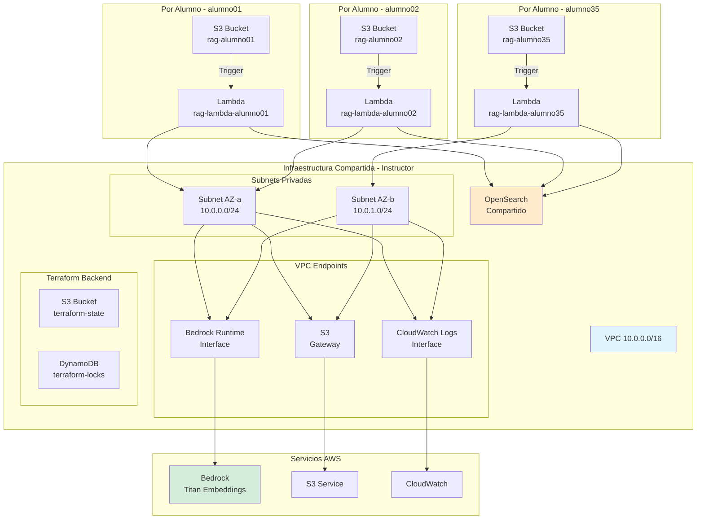
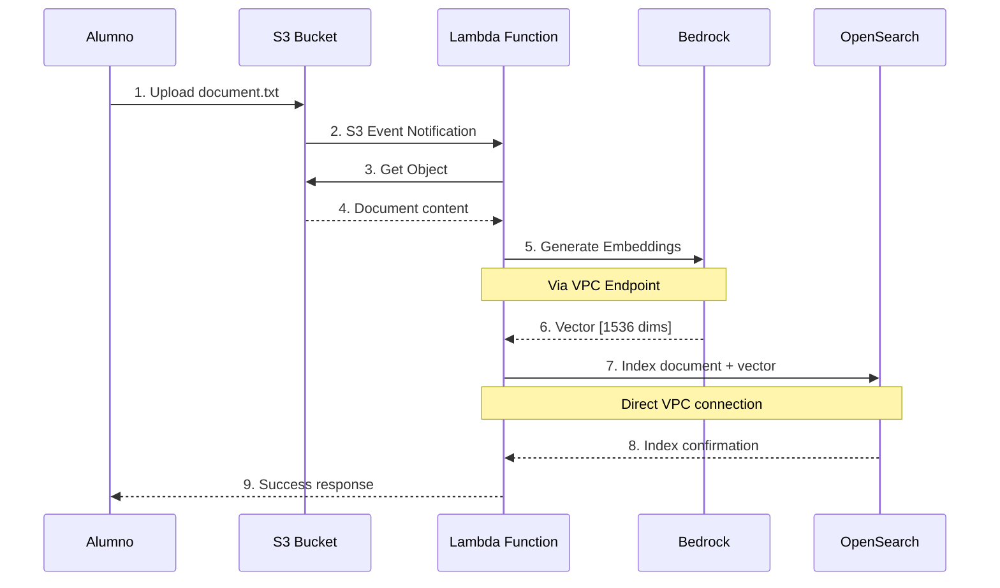
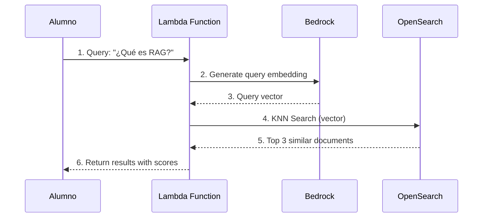
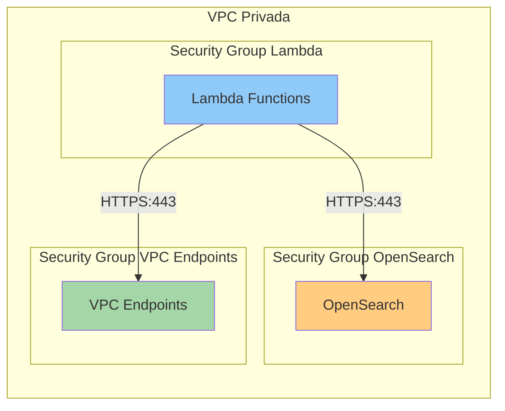
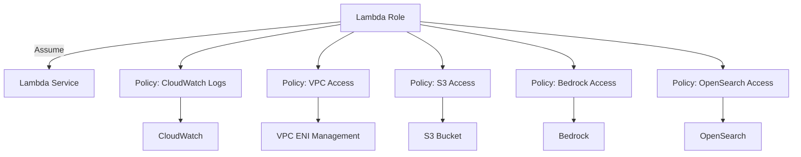
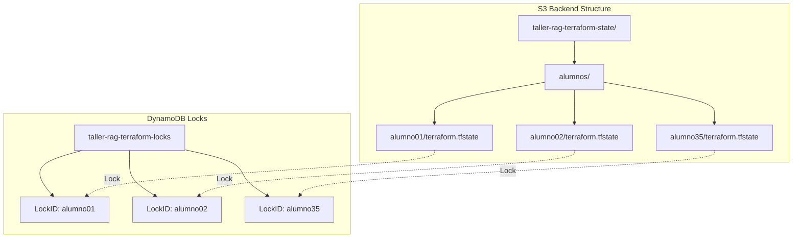
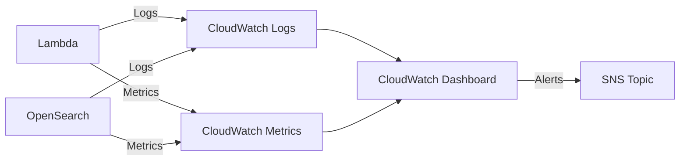
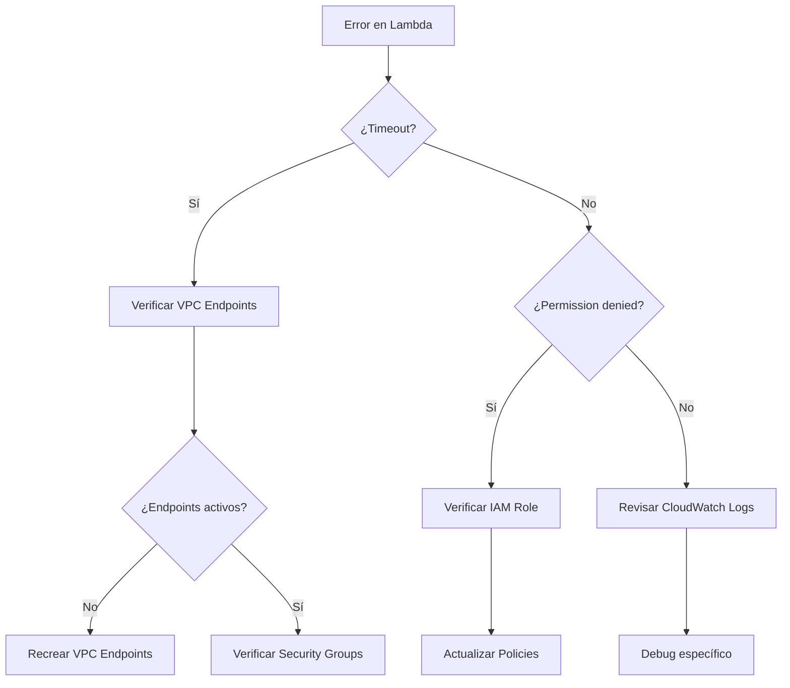

# Arquitectura Detallada - Taller RAG

## Vista General

Este documento describe la arquitectura completa del taller RAG, diseñada para 35 alumnos desplegando infraestructura serverless en AWS.

## Diagrama de Arquitectura Completa



## Flujo de Datos - Indexación de Documentos



## Flujo de Datos - Query RAG



## Capas de Red y Seguridad



### Reglas de Security Groups

#### Lambda SG (Egress)
```
Protocol: TCP
Port: 443
Destination: OpenSearch SG
Description: HTTPS to OpenSearch

Protocol: TCP
Port: 443
Destination: VPC Endpoints SG
Description: HTTPS to VPC Endpoints
```

#### OpenSearch SG (Ingress)
```
Protocol: TCP
Port: 443
Source: Lambda SG
Description: HTTPS from Lambda functions
```

#### VPC Endpoints SG (Ingress)
```
Protocol: TCP
Port: 443
Source: VPC CIDR (10.0.0.0/16)
Description: HTTPS from VPC
```

## IAM Permissions

### Lambda Execution Role



### Permisos Específicos

**S3 Access**
```json
{
  "Effect": "Allow",
  "Action": [
    "s3:GetObject",
    "s3:ListBucket",
    "s3:PutObject"
  ],
  "Resource": [
    "arn:aws:s3:::rag-alumno01",
    "arn:aws:s3:::rag-alumno01/*"
  ]
}
```

**Bedrock Access**
```json
{
  "Effect": "Allow",
  "Action": ["bedrock:InvokeModel"],
  "Resource": "arn:aws:bedrock:us-east-1::foundation-model/amazon.titan-embed-text-v1"
}
```

**OpenSearch Access**
```json
{
  "Effect": "Allow",
  "Action": [
    "es:ESHttpGet",
    "es:ESHttpPost",
    "es:ESHttpPut",
    "es:ESHttpDelete"
  ],
  "Resource": "arn:aws:es:us-east-1:*:domain/taller-rag/*"
}
```

## Terraform State Management



## OpenSearch Index Structure

Cada alumno tiene su propio índice: `rag-alumno01`, `rag-alumno02`, etc.

```json
{
  "settings": {
    "index": {
      "knn": true,
      "number_of_shards": 1,
      "number_of_replicas": 0
    }
  },
  "mappings": {
    "properties": {
      "text": {
        "type": "text"
      },
      "embedding": {
        "type": "knn_vector",
        "dimension": 1536
      },
      "metadata": {
        "type": "object"
      },
      "timestamp": {
        "type": "date"
      }
    }
  }
}
```

### Ejemplo de Documento Indexado

```json
{
  "_index": "rag-alumno01",
  "_id": "documents/sample.txt",
  "_source": {
    "text": "Este es un documento sobre RAG...",
    "embedding": [0.123, -0.456, 0.789, ...],
    "metadata": {
      "bucket": "rag-alumno01",
      "key": "documents/sample.txt"
    },
    "timestamp": "2025-11-10T15:30:00Z"
  }
}
```

## Escala y Límites

### Por Alumno
- **Lambda**: 1 función
- **S3 Bucket**: 1 bucket
- **OpenSearch Index**: 1 índice

### Compartido (todos los alumnos)
- **VPC**: 1 VPC
- **Subnets**: 2 subnets privadas
- **VPC Endpoints**: 3 endpoints
- **OpenSearch Domain**: 1 dominio

### Service Quotas a Verificar

| Servicio | Quota | Mínimo Requerido |
|----------|-------|------------------|
| VPC Endpoints | Per Region | 5 |
| Lambda Concurrent Executions | Per Region | 100 |
| OpenSearch Instances | Per Region | 1 |
| S3 Buckets | Per Account | 40 |

## Optimizaciones de Costos

1. **OpenSearch**: Single-AZ, t3.small (desarrollo)
2. **VPC Endpoints**: Solo los necesarios (Bedrock, S3, Logs)
3. **Lambda**: Memoria optimizada (512MB)
4. **S3**: Lifecycle para limpiar versiones antiguas

## Consideraciones de Seguridad

1. **Network Isolation**: Lambdas en VPC privada
2. **No Public IPs**: Todo el tráfico interno
3. **Encryption**: S3 y OpenSearch con encryption at rest
4. **TLS**: OpenSearch con enforce HTTPS
5. **Fine-grained Access**: IAM roles con least privilege
6. **Secrets Management**: OpenSearch password en SSM Parameter Store

## Failover y Alta Disponibilidad

Para producción (no implementado en el taller):

- Multi-AZ OpenSearch
- Lambda en múltiples subnets
- NAT Gateway con failover
- S3 cross-region replication

## Monitoreo



### Métricas Clave

**Lambda**
- Invocations
- Duration
- Errors
- Throttles

**OpenSearch**
- ClusterStatus
- SearchRate
- IndexingRate
- CPUUtilization

## Troubleshooting Decision Tree



## Referencias

- [AWS VPC Endpoints](https://docs.aws.amazon.com/vpc/latest/privatelink/vpc-endpoints.html)
- [Amazon Bedrock](https://docs.aws.amazon.com/bedrock/)
- [Amazon OpenSearch](https://docs.aws.amazon.com/opensearch-service/)
- [AWS Lambda in VPC](https://docs.aws.amazon.com/lambda/latest/dg/configuration-vpc.html)
