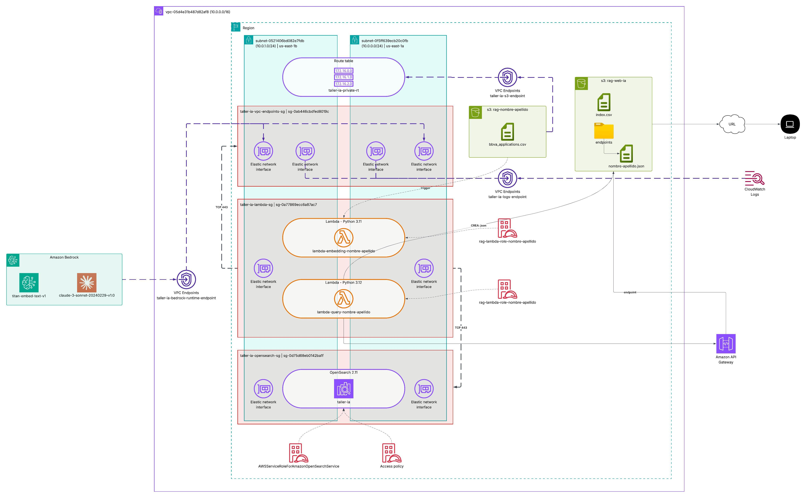
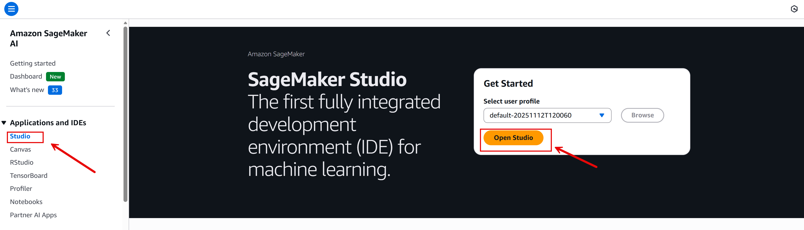
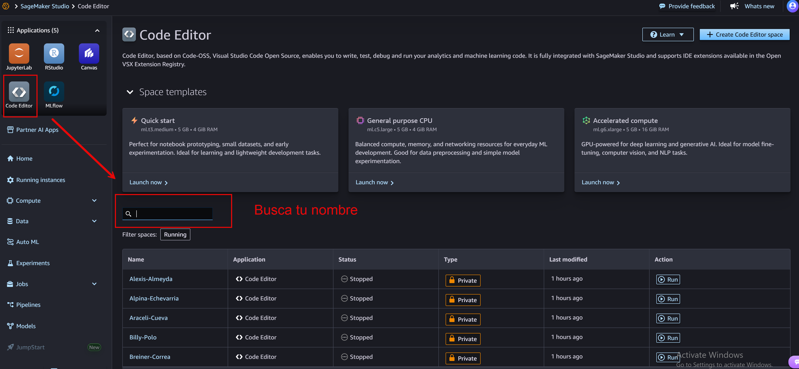
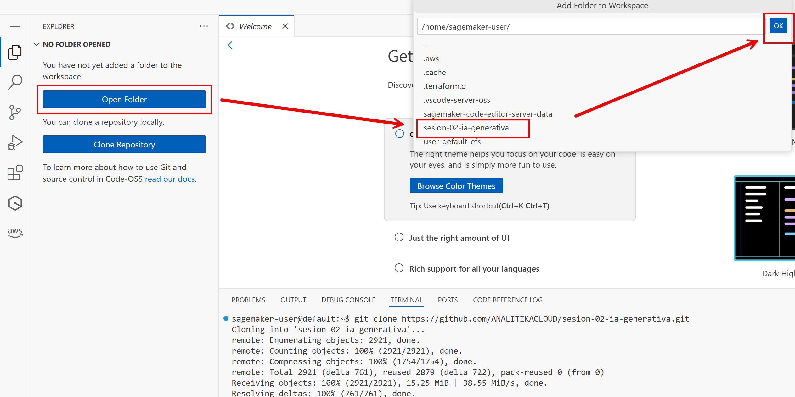

# Taller RAG con AWS - Arquitectura

## Objetivo
Cada participante desplegará su propia infraestructura RAG (Retrieval Augmented Generation) usando Bedrock, Lambda, S3 y OpenSearch compartido.

## Arquitectura



```

Cada alumno:
├── S3 Bucket (rag-alumno-XX)
└── Lambda (rag-lambda-alumno-XX)
    ├── Lee documentos de S3
    ├── Genera embeddings con Bedrock
    └── Indexa en OpenSearch (índice separado)
```

## Credenciales
accountID: 471112840515

usuario: [nombre].[apellido]

password: Participante2025!


# Instrucciones para participantes

Acceder a la consola de AWS con sus credenciales

- Ir al servicio de Amazon SageMaker AI -> Studio -> Open Studio



- Code Editor -> Busca tu nombre -> Run


### 1. Clonar repositorio


```bash
git clone https://github.com/ANALITIKACLOUD/sesion-02-ia-generativa.git
```


```bash
cd sesion-02-ia-generativa
```
### 2. Instalar Terraform


#### 2.1. Descargar

```bash
wget https://releases.hashicorp.com/terraform/1.9.8/terraform_1.9.8_linux_amd64.zip
```
#### 2.2. Descomprimir
```bash
unzip terraform_1.9.8_linux_amd64.zip
```
#### 2.3. Mover a /usr/local/bin
```bash
sudo mv terraform /usr/local/bin/
```
#### 2.4. Verificar instalación
```bash
terraform version
```

### 3. Configurar tu ID de alumno

export ALUMNO_ID="nombre-apellido"  # Cambiar por su nombre y apellido en minuscula

### 4. Copiar archivo de variables
```bash
cd alumno
```
```bash
cp terraform.tfvars.example terraform.tfvars
```
### 5. Editar terraform.tfvars con tu ALUMNO_ID
 editar terraform.tfvars

### Desplegar infraestructura
```bash
# Validar ALUMNO_ID (nombre-apellido)
echo ${ALUMNO_ID}
```
```bash
# Inicializar con tu alumno_id
terraform init -backend-config="key=alumnos/${ALUMNO_ID}/terraform.tfstate"
```
```bash
# Aplicar
terraform apply
```
Aceptar deploy:
```bash
Do you want to perform these actions?
  Terraform will perform the actions described above.
  Only 'yes' will be accepted to approve.

  Enter a value: yes
```


## Estructura del proyecto

```
.
├── shared/                   # Infraestructura compartida (instructor)
│   ├── vpc.tf
│   ├── vpc_endpoints.tf
│   ├── opensearch.tf
│   ├── security_groups.tf
│   ├── backend.tf
│   └── outputs.tf
│
├── alumno/                  # Infraestructura por alumno
│   ├── backend.tf
│   ├── variables.tf
│   ├── terraform.tfvars.example
│   ├── lambda.tf
│   ├── s3.tf
│   └── iam.tf
│
├── lambda/                   # Código del Lambda (común)
│   ├── index.py
│   ├── requirements.txt
│   └── rag_logic.py
│
└── scripts/                  # Utilidades
    ├── setup-student.sh
    └── cleanup-all.sh
```

## Costos estimados

| Recurso | Cantidad | Costo mensual |
|---------|----------|---------------|
| VPC | 1 | Gratis |
| VPC Endpoint Bedrock | 1 | ~$7 |
| VPC Endpoint S3 | 1 | Gratis |
| OpenSearch t3.small | 1 | ~$35 |
| Lambda (tier gratis) | 35 | ~Gratis |
| S3 (pocos MB) | 35 | ~$0.10 |
| **Total taller 4h** | | **~$1** |

## Notas importantes

1. **Parametrización**: Cada alumno usa su `ALUMNO_ID` único para evitar conflictos
2. **OpenSearch compartido**: Cada alumno escribe en su índice `rag-{alumno_id}`
3. **Lambda privado**: Sin acceso a internet, solo a servicios AWS vía VPC endpoints
4. **Terraform state**: Backend S3 compartido con key por alumno

## Troubleshooting

### Lambda no puede conectarse a Bedrock
- Verificar que el VPC endpoint esté activo
- Revisar security group del Lambda

### No hay permisos para escribir en OpenSearch
- Verificar IAM role del Lambda incluye permisos de OpenSearch
- Confirmar que el security group permite tráfico desde Lambda SG

### Probar Lambda Query
```bash
{
  "body": "{\"question\": \"¿Qué aplicaciones críticas tiene Colombia?\"}"
}
```

### Terraform state lock
```bash
# Ver locks activos
aws dynamodb scan --table-name taller-rag-locks

# Liberar lock (con cuidado)
terraform force-unlock <lock-id>
```
